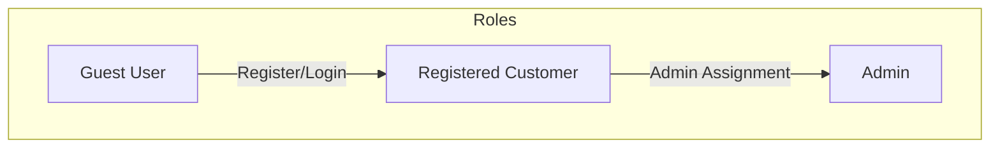
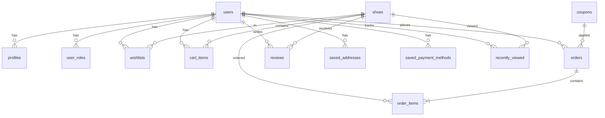
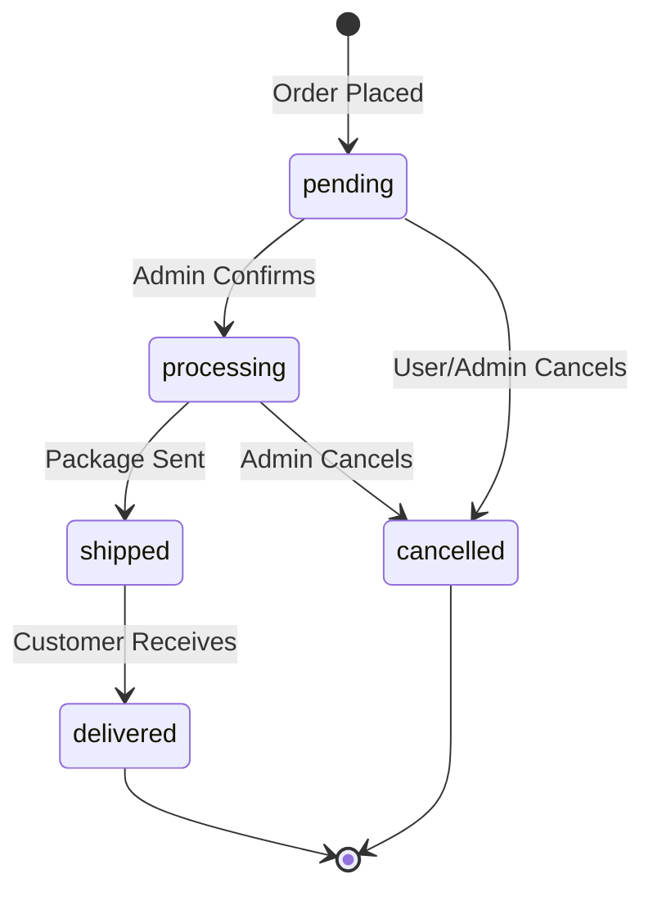
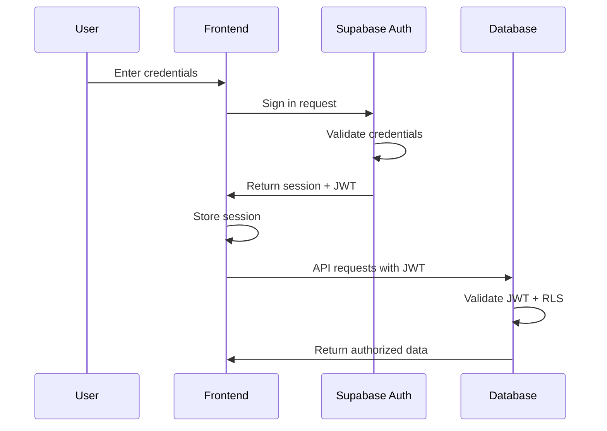
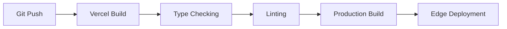

# Product Requirements Document (PRD)
# Tokyo Kicks Collection 👟

---

## 1. Executive Summary

**Tokyo Kicks Collection** is a premium e-commerce web application designed for sneaker enthusiasts. Built with modern web technologies, it provides an immersive, feature-rich shopping experience with a comprehensive admin dashboard for inventory and order management.

| Attribute | Details |
|-----------|---------|
| **Product Name** | Tokyo Kicks Collection |
| **Version** | 1.0.0 |
| **Platform** | Web (Desktop & Mobile Responsive) |
| **Target Users** | Sneaker enthusiasts, fashion-conscious consumers |
| **Deployment** | Vercel (optimized) |

---

## 2. Project Overview

### 2.1 Vision Statement
To create the most engaging and user-friendly sneaker shopping experience that combines modern aesthetics with seamless functionality, enabling customers to discover, purchase, and track their favorite sneakers effortlessly.

### 2.2 Business Objectives
- **User Engagement**: Provide an immersive product browsing experience with advanced filtering and search
- **Conversion Optimization**: Streamlined checkout process with saved addresses and payment methods
- **Customer Retention**: Wishlist, recently viewed, and order tracking features
- **Operational Efficiency**: Admin dashboard for complete inventory and order management

### 2.3 Success Metrics
| Metric | Target |
|--------|--------|
| Page Load Time | < 2 seconds |
| Cart Abandonment Rate | < 30% |
| Mobile Responsiveness | 100% feature parity |
| User Registration Rate | > 40% of visitors |

---

## 3. Technology Stack

### 3.1 Frontend
| Technology | Purpose |
|------------|---------|
| **React 18** | UI Component Library |
| **TypeScript** | Type-safe Development |
| **Vite** | Build Tool & Dev Server |
| **Tailwind CSS** | Utility-first Styling |
| **Shadcn UI** | Component Library |
| **Framer Motion** | Animations & Transitions |
| **TanStack Query** | Server State Management |
| **React Hook Form + Zod** | Form Handling & Validation |
| **React Router DOM** | Client-side Routing |

### 3.2 Backend & Infrastructure
| Technology | Purpose |
|------------|---------|
| **Supabase** | Backend-as-a-Service |
| **PostgreSQL** | Relational Database |
| **Supabase Auth** | Authentication & Authorization |
| **Supabase Storage** | Image & File Storage |
| **Supabase Edge Functions** | Serverless Functions |
| **Row Level Security (RLS)** | Data Access Control |

### 3.3 Utilities & Integrations
| Library | Purpose |
|---------|---------|
| **jspdf + jspdf-autotable** | Invoice PDF Generation |
| **Lucide React** | Icon Library |
| **Sonner** | Toast Notifications |
| **Vercel Analytics** | Performance Monitoring |
| **Vercel Speed Insights** | Core Web Vitals |
| **browser-image-compression** | Image Optimization |

---

## 4. User Roles & Permissions

### 4.1 Role Definitions

| Role | Permissions |
|------|-------------|
| **Guest** | Browse catalog, view products, add to cart, contact support |
| **Customer** | All guest permissions + wishlist, checkout, order history, profile management, reviews |
| **Admin** | All customer permissions + inventory management, order management, coupon management, dashboard analytics |

### 4.2 Authentication Methods
- Email/Password registration and login
- Google OAuth integration
- Password reset via email
- Session management with Supabase Auth

---

## 5. Database Schema

### 5.1 Entity Relationship Diagram

### 5.2 Table Definitions

| Table | Description | Key Fields |
|-------|-------------|------------|
| **profiles** | User profile information | id, username, first_name, last_name, phone, avatar_url |
| **user_roles** | Role assignments | user_id, role (admin/customer) |
| **shoes** | Product catalog | id, name, brand, price, image_url, sizes[], status |
| **wishlists** | User wishlists | user_id, shoe_id, added_at |
| **cart_items** | Shopping cart | user_id, shoe_id, size, quantity, color |
| **orders** | Order records | id, user_id, order_code, status, total, shipping_info |
| **order_items** | Order line items | order_id, shoe_id, size, quantity, price, color |
| **reviews** | Product reviews | shoe_id, user_id, rating, comment |
| **coupons** | Discount codes | code, discount_type, discount_value, validity |
| **saved_addresses** | Stored addresses | user_id, address, city, postal_code, phone |
| **saved_payment_methods** | Stored cards | user_id, card_last_four, card_brand, expiry |
| **recently_viewed** | View history | user_id, shoe_id, viewed_at |

---

## 6. Feature Specifications

### 6.1 Customer-Facing Features

#### 6.1.1 Product Catalog & Discovery

| Feature | Description | Priority |
|---------|-------------|----------|
| **Product Listing** | Grid display with pagination (12 products per page) | P0 |
| **Search** | Real-time search by product name and brand | P0 |
| **Filtering** | Filter by brand, price range, size availability | P0 |
| **Sorting** | Sort by price (low/high), newest, popularity | P0 |
| **Quick View** | Modal preview without leaving catalog | P1 |
| **Recently Viewed** | Track and display recently viewed products | P2 |

#### 6.1.2 Product Detail Page

| Feature | Description | Priority |
|---------|-------------|----------|
| **Image Gallery** | Multiple product images with thumbnails | P0 |
| **Image Zoom** | High-resolution zoom on hover/click | P1 |
| **Fullscreen Gallery** | Immersive image viewing experience | P1 |
| **Size Selection** | Size picker with availability indicators | P0 |
| **Size Guide** | Modal with sizing chart | P1 |
| **Add to Cart** | Size-specific cart addition | P0 |
| **Add to Wishlist** | One-click wishlist toggle | P1 |
| **Product Reviews** | View and submit reviews with star ratings | P1 |
| **Related Products** | Recommendations carousel | P2 |
| **Social Sharing** | Share product links via social/clipboard | P2 |

#### 6.1.3 Shopping Cart

| Feature | Description | Priority |
|---------|-------------|----------|
| **Cart Management** | View, update quantities, remove items | P0 |
| **Size/Color Display** | Show selected variants | P0 |
| **Price Summary** | Subtotal with item breakdown | P0 |
| **Persistent Cart** | Cart synced to user account | P0 |
| **Stock Validation** | Check availability before checkout | P0 |

#### 6.1.4 Checkout Process

| Feature | Description | Priority |
|---------|-------------|----------|
| **Guest Checkout** | Checkout without registration | P1 |
| **Shipping Form** | Address collection with validation | P0 |
| **Saved Addresses** | Select from previously used addresses | P1 |
| **Shipping Methods** | Standard and Express options | P0 |
| **Coupon Codes** | Apply discount codes | P1 |
| **Delivery Validation** | 5km radius check from shop location | P1 |
| **Order Summary** | Complete breakdown before payment | P0 |

#### 6.1.5 Payment

| Feature | Description | Priority |
|---------|-------------|----------|
| **Card Payment** | Credit/Debit card processing | P0 |
| **Cash on Delivery** | COD option | P1 |
| **Saved Payment Methods** | Reuse stored cards | P2 |
| **Expiry Validation** | Prevent expired card submission | P0 |
| **Order Confirmation** | Success page with order details | P0 |

#### 6.1.6 Order Management

| Feature | Description | Priority |
|---------|-------------|----------|
| **Order History** | List of all past orders | P0 |
| **Order Details** | Complete order breakdown | P0 |
| **Order Tracking** | Visual timeline with status updates | P0 |
| **Order Cancellation** | Cancel within allowed window | P1 |
| **Invoice Download** | Generate and download PDF invoice | P1 |

#### 6.1.7 User Account

| Feature | Description | Priority |
|---------|-------------|----------|
| **Profile Management** | Edit personal information | P0 |
| **Change Password** | Update account password | P1 |
| **Saved Addresses** | Manage delivery addresses | P1 |
| **Saved Payment Methods** | Manage stored cards | P2 |
| **Wishlist** | View and manage saved products | P1 |

### 6.2 Admin Dashboard Features

#### 6.2.1 Dashboard Overview

| Feature | Description | Priority |
|---------|-------------|----------|
| **Analytics Summary** | Key metrics overview | P1 |
| **Recent Orders** | Latest order activity | P0 |
| **Quick Actions** | Shortcuts to common tasks | P1 |

#### 6.2.2 Inventory Management

| Feature | Description | Priority |
|---------|-------------|----------|
| **Product List** | View all products with search/filter | P0 |
| **Add Product** | Create new product entries | P0 |
| **Edit Product** | Modify existing products | P0 |
| **Delete Product** | Remove products (with image cleanup) | P0 |
| **Image Upload** | Upload product images to storage | P0 |
| **Stock Status** | Toggle in_stock/sold_out status | P0 |
| **Clean Storage** | Remove orphaned images | P2 |

#### 6.2.3 Order Management

| Feature | Description | Priority |
|---------|-------------|----------|
| **Order List** | View all orders with filtering | P0 |
| **Order Details** | Complete order information | P0 |
| **Status Updates** | Change order status | P0 |
| **Order Search** | Find orders by code/customer | P1 |

#### 6.2.4 Coupon Management

| Feature | Description | Priority |
|---------|-------------|----------|
| **Coupon List** | View all discount codes | P1 |
| **Create Coupon** | Add new coupons (percentage/fixed) | P1 |
| **Edit Coupon** | Modify coupon details | P1 |
| **Activate/Deactivate** | Toggle coupon availability | P1 |

---

## 7. Page Structure & Routes

### 7.1 Public Routes

| Route | Page | Description |
|-------|------|-------------|
| `/` | Home | Product catalog with hero section |
| `/product/:id` | Product Detail | Full product information |
| `/auth` | Authentication | Login/Register forms |
| `/update-password` | Password Reset | Password recovery page |
| `/cart` | Shopping Cart | Cart review |
| `/checkout` | Checkout | Shipping information form |
| `/payment` | Payment | Payment processing |
| `/order/:id` | Order Details | Order confirmation/details |
| `/track-order/:id` | Order Tracking | Live order status |
| `/contact` | Contact | Contact form and info |
| `/privacy` | Privacy Policy | Legal information |
| `/terms` | Terms of Service | Legal information |

### 7.2 Protected Routes (Requires Authentication)

| Route | Page | Description |
|-------|------|-------------|
| `/profile` | My Profile | User account settings |
| `/wishlist` | Wishlist | Saved products |
| `/order-history` | Order History | Past orders list |

### 7.3 Admin Routes (Requires Admin Role)

| Route | Page | Description |
|-------|------|-------------|
| `/admin` | Dashboard | Admin overview |
| `/admin/orders` | Orders | Order management |
| `/admin/orders/:orderId` | Order Details | Admin order view |
| `/admin/inventory` | Inventory | Product management |
| `/admin/inventory/add` | Add Product | Create new product |
| `/admin/inventory/edit/:id` | Edit Product | Modify product |
| `/admin/coupons` | Coupons | Coupon management |

---

## 8. Order Status Flow

| Status | Description | User Can Cancel? |
|--------|-------------|------------------|
| **pending** | Order received, awaiting confirmation | ✅ Yes |
| **processing** | Order confirmed, being prepared | ❌ No |
| **shipped** | Package in transit | ❌ No |
| **delivered** | Successfully delivered | ❌ No |
| **cancelled** | Order cancelled | N/A |

---

## 9. Security & Access Control

### 9.1 Row Level Security (RLS) Policies

| Table | Policy | Description |
|-------|--------|-------------|
| **profiles** | Own profile access | Users can only view/edit their own profile |
| **wishlists** | Owner only | Users can only access their own wishlist |
| **cart_items** | Owner only | Users can only access their own cart |
| **orders** | Owner + Admin | Users see their orders, admins see all |
| **shoes** | Public read, Admin write | Everyone can view, only admins can modify |
| **coupons** | Public read, Admin write | Everyone can view active coupons |
| **reviews** | Public read, Auth write | Anyone can read, authenticated users can create |
| **storage** | Public read, Admin upload | Admin-only image uploads |

### 9.2 Authentication Flow

---

## 10. UI/UX Guidelines

### 10.1 Design Principles
- **Modern Aesthetics**: Clean, minimalist design with premium feel
- **Mobile-First**: Responsive design optimized for all screen sizes
- **Micro-Interactions**: Subtle animations for enhanced user experience
- **Accessibility**: WCAG 2.1 AA compliance target

### 10.2 Component Library
Built on Shadcn UI with custom styling:
- Buttons, Inputs, Cards, Dialogs
- Dropdowns, Tabs, Accordions
- Toast notifications via Sonner
- Loading states with custom TextLoader

### 10.3 Animation Strategy
Framer Motion integration for:
- Page transitions
- Component mount/unmount animations
- Hover effects and micro-interactions
- Scroll-based animations

---

## 11. Performance Optimization

### 11.1 Implemented Optimizations

| Optimization | Implementation |
|--------------|----------------|
| **Code Splitting** | Lazy loading via React.lazy() for all pages |
| **Image Optimization** | Browser-image-compression for uploads |
| **Query Caching** | TanStack Query with intelligent cache |
| **Bundle Size** | Tree-shaking with Vite |
| **CDN Delivery** | Vercel Edge Network |

### 11.2 Monitoring
- **Vercel Analytics**: User behavior tracking
- **Speed Insights**: Core Web Vitals monitoring
- **Error Boundary**: Global error catching and reporting

---

## 12. Deployment & Infrastructure

### 12.1 Deployment Pipeline

### 12.2 Environment Configuration

| Variable | Purpose |
|----------|---------|
| `VITE_SUPABASE_URL` | Supabase project URL |
| `VITE_SUPABASE_ANON_KEY` | Public API key |

### 12.3 Hosting Configuration
- **Platform**: Vercel
- **Build Command**: `npm run build`
- **Output Directory**: `dist`
- **Routing**: SPA fallback configured in `vercel.json`

---

## 13. Future Roadmap

### Phase 2 Enhancements
| Feature | Description | Priority |
|---------|-------------|----------|
| **Email Notifications** | Order status updates via email | P1 |
| **Multi-Language** | Internationalization support | P2 |
| **Advanced Analytics** | Detailed sales reports | P2 |
| **Inventory Alerts** | Low stock notifications | P2 |

### Phase 3 Expansions
| Feature | Description | Priority |
|---------|-------------|----------|
| **Mobile App** | React Native companion app | P3 |
| **Live Chat** | Customer support integration | P3 |
| **Product Recommendations** | AI-powered suggestions | P3 |
| **Loyalty Program** | Points and rewards system | P3 |

---

## 14. Appendix

### 14.1 Glossary

| Term | Definition |
|------|------------|
| **RLS** | Row Level Security - PostgreSQL feature for data access control |
| **JWT** | JSON Web Token - Secure authentication token |
| **SSR** | Server-Side Rendering |
| **SPA** | Single Page Application |
| **COD** | Cash on Delivery |

### 14.2 Related Documents
- [README.md](file:///c:/D%20drive%20D/College%20Detailed%20Projects/ai%20projects/client/Tokyo%20shoes%20reactjs/tokyo-shoes-collection/README.md) - Project setup guide
- [Supabase OAuth Guide](file:///c:/D%20drive%20D/College%20Detailed%20Projects/ai%20projects/client/Tokyo%20shoes%20reactjs/tokyo-shoes-collection/SUPABASE_OAUTH_GUIDE.md) - OAuth configuration
- [Database Setup SQL](file:///c:/D%20drive%20D/College%20Detailed%20Projects/ai%20projects/client/Tokyo%20shoes%20reactjs/tokyo-shoes-collection/database-setup.sql) - Database schema

---

> **Document Version**: 1.0.0  
> **Last Updated**: February 9, 2026  
> **Author**: Generated from codebase analysis
